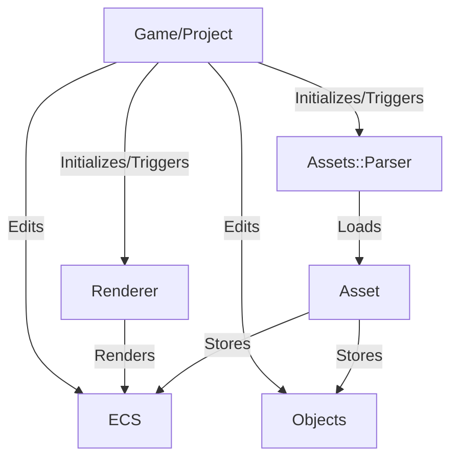

# TabGraph
*tabGraph* is a full SceneGraph featuring a flexible Component system, giving a lot of freedom for adding new components to your scene and organizing it.

# Features
*tabGraph* features several functionnalities :
 - Temporal Anti-Aliasing
 - Screen Space Reflection
 - Screen Space Ambient Occlusion
 - Smooth Shadows
 - Blended Order-Independant Transparency
 - Physically Based Materials, with MaterialExtensions allowing for various PBR workflows.
 - GPU Rigging
 - Animations

# Subsystems and their role

The [*ECS*](./ECS) system is the foundation of the whole project.
A [*SceneGraph*](./SceneGraph) is generated by the [*Assets*](./Assets) parser or the user using the ECS system
The SceneGraph is then given to the [*Renderer*](./Renderer)
The Game/Project is in charge of managing window, assets and triggering rendering
The common tools for the whole project are located in [*Tools*](./Tools)
Demos and tests are located in [*UnitTests*](./UnitTests)

# Dependencies
Dependencies are automatically fetched using CMake.

# TODO List
If you want to participate, here is the [TODO List](/TODO.md)

# Screenshots

