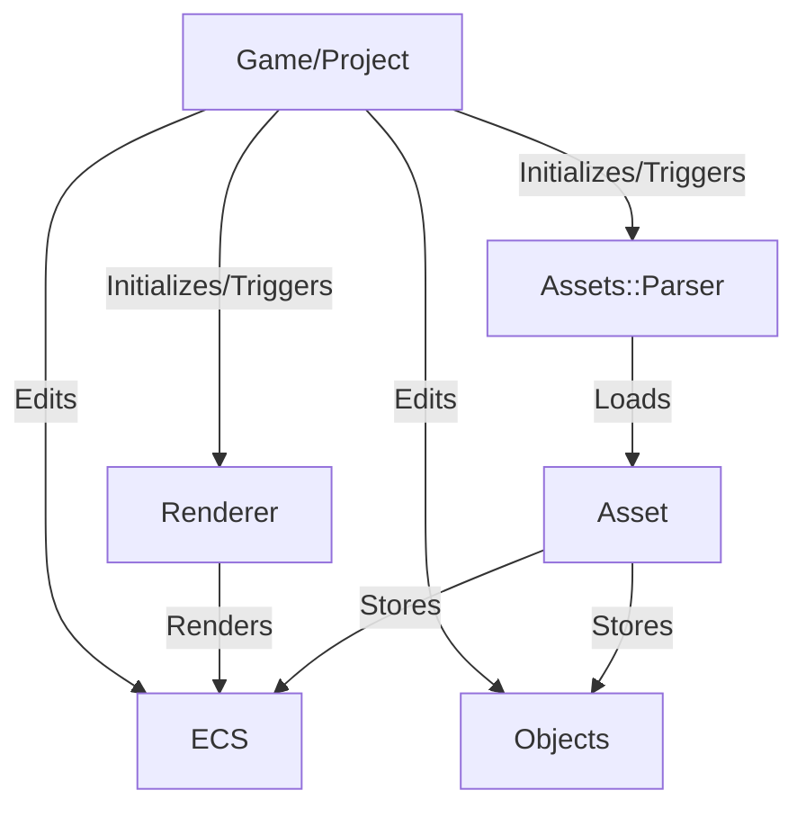

# TabGraph
*tabGraph* is a full SceneGraph featuring a flexible Component system, giving a lot of freedom for adding new components to your scene and organizing it.

# Subsystems and their role

The [*ECS*](./ECS) system is the foundation of the whole project.
A [*SceneGraph*](./SceneGraph) is generated by the [*Assets*](./Assets) parser or the user using the ECS system
The SceneGraph is then given to the [*Renderer*](./Renderer)
The Game/Project is in charge of managing window, assets and triggering rendering
The common tools for the whole project are located in [*Tools*](./Tools)
Demos and tests are located in [*UnitTests*](./UnitTests)

# Dependencies
Dependencies are automatically fetched using CMake.

This project was made with the will to reduce dependencies to what's strictly necessary:
 - [GLEW][8] for OpenGL because I don't wanna query extensions manually*
 - [STB][11] for image parsing
 - [zlib][3] for FBX parsing
 - [GLM][1] for vectorial math
 - [SDL2][6] for Scene Renderer window system and events
 - [Nlohmann JSON][2] for parsing GLTF
 - [GTest][4] GTest for unit tests
 - [EGL-Registry][5] & [GL-Registry][7] for KTX parsing
 - [GCEM][9] for accelerated Spherical Harmonics calculation

# TODO List
If you want to participate, see the issues for task lists

# Features
*tabGraph* features several functionnalities :
 - Temporal Anti-Aliasing
 - Temporal Accumulation
 - Screen Space Reflection inspired by Unreal Engine
 - Screen Space Ambient Occlusion
 - Smooth Shadows
 - Blended Order-Independant Transparency
 - Physically Based Materials, with MaterialExtensions allowing for various PBR workflows.
 - GPU Rigging
 - Animations

[1]: https://github.com/g-truc/glm.git
[2]: https://github.com/nlohmann/json.git
[3]: https://www.zlib.net
[4]: https://github.com/google/googletest
[5]: https://github.com/KhronosGroup/EGL-Registry.git
[6]: https://github.com/libsdl-org/SDL
[7]: https://github.com/KhronosGroup/OpenGL-Registry/
[8]: https://github.com/Perlmint/glew-cmake.git
[9]: https://github.com/kthohr/gcem.git
[10]: http://download.gisinternals.com/sdk/
[11]: https://github.com/nothings/stb/tree/master
